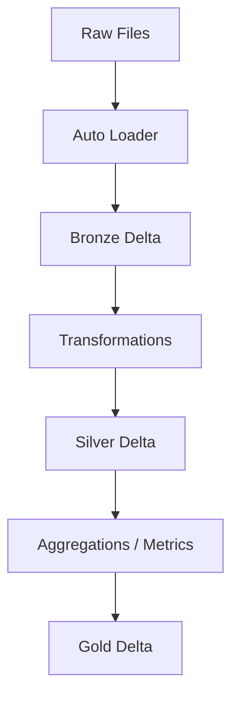

# Medallion Architecture ELT Pipeline (Serverless Databricks)

A hands-on, end-to-end demonstration of the Medallion Architecture data pipeline, implemented in Databricks. It is purposed as a basic demonstration of the medallion pattern, with three layers:

- **Bronze Layer**: ingestion of raw data with Auto Loader
- **Silver Layer**: schema enforcement, standardizing formats, preparing the data for downstream gold layer logic.
- **Gold Layer**: data in this layer needs to encourage analysis and interpretation, with low effort.



## Repository Structure

```
medallion-pipeline/
│
├── notebooks/
│ ├── 00_setup_catalog_and_schemas.sql
│ ├── 01_generate_orders.py
│ ├── 02_bronze_ingest_autoloader.py
│ ├── 03_silver_transform.py
│ └── 04_gold_aggregations.py
│
├── workflows/
│ └── medallion_pipeline.json
│
├── sample_data/
│ └── orders_001.json
│ └── orders_002.json
│ └── README.md
│
├── diagrams/
│ └── medallion_architecture.png
│
├── .gitignore
└── README.md
```

- **notebooks/** — All ETL notebooks for Bronze, Silver, and Gold, as well as sql for setting up the catalog and python script for generating syntatic general orders data and writing in a volume.
- **workflows/** — Databricks serverless job definition (JSON).
- **sample_data/** — Sample of the data generated by 01_generate_orders.py
- **diagrams/** — Architecture diagrams (Mermaid + PNG).
