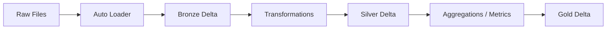

# Medallion Architecture ELT Pipeline (Serverless Databricks)

A hands-on, end-to-end demonstration of the Medallion Architecture data pipeline, implemented in Databricks. It is purposed as a basic demonstration of the medallion pattern, with three layers:

- **Bronze Layer**: ingestion of raw data with Auto Loader
- **Silver Layer**: schema enforcement, standardizing formats, preparing the data for downstream gold layer logic.
- **Gold Layer**: data in this layer needs to encourage analysis and interpretation, with low effort.

